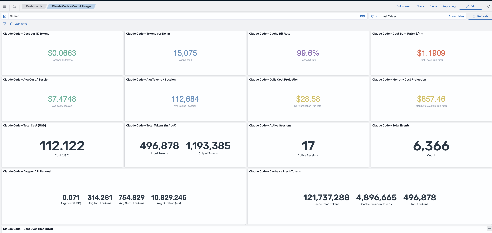

# Claude Code → OpenSearch telemetry stack

A local, single-node OpenSearch stack that captures OpenTelemetry data from your
Claude Code CLI and visualises tool usage, permissions, cost, tokens and API
health. Everything runs on your laptop and is bound to `localhost` only.



*The pre-provisioned "Claude Code – Cost & Usage" dashboard: efficiency KPIs
(cost per 1K tokens, tokens per dollar, cache hit rate, burn rate), per-session
averages, cost/token projections, and top-line totals.*

## Architecture

```
Claude Code (host CLI, all projects)
   │  OTLP/gRPC :4317, OTLP/HTTP :4318   (logs/events + traces)
   ▼
OTel Collector (contrib build)
   │  otlp receiver → logs pipeline   (transform/enrich → opensearch)
   │               → traces pipeline  (opensearch)
   ▼
OpenSearch  :9200   (single node, security disabled, persistent volume)
   ▲
OpenSearch Dashboards :5601   ── pre-provisioned "Claude Code – Cost & Usage" dashboard
```

Claude Code can emit three OTLP signals — **logs/events**, **metrics** and
**traces**. This stack captures **logs and traces**:

- **Logs/events** carry everything the dashboard needs — `tool_name`, `success`,
  `duration_ms`, `cost_usd`, `input/output_tokens`, `model`, `decision`. They land
  in the OpenSearch **data stream** `ss4o_logs-claudecode-telemetry` (ss4o
  observability schema), which rolls over daily with 2-year retention (see
  [Data retention](#data-retention-data-stream--ism)). Event fields live under
  `attributes.*` and the event type is in `body` (e.g. `claude_code.tool_result`).
- **Traces** are a Claude Code beta (`CLAUDE_CODE_ENHANCED_TELEMETRY_BETA`);
  `enable-telemetry.sh` turns them on. Spans land in the plain index
  `ss4o_traces-claudecode-telemetry` (no retention policy yet — prune manually).
- **Metrics are not captured.** The `opensearch` exporter has no metrics support,
  so `OTEL_METRICS_EXPORTER` is left unset; capturing Claude Code's metrics
  (lines-of-code, commit/PR counts, etc.) would require a separate backend such as
  Prometheus.

## Prerequisites

- Docker (Docker Desktop or any Docker-compatible runtime) with the daemon
  running.
- `python3` and `curl` on the host (used by the setup scripts).
- The `claude` CLI installed.

## Quick start

```bash
cd ~/claude-otel-stack

# 1. Bring up OpenSearch + Dashboards + Collector, apply mappings, import dashboards.
#    First run builds the collector image; re-run any time to re-provision.
./scripts/setup.sh
# (setup.sh == start.sh --build; thereafter just ./scripts/start.sh.
#  add --verify to push a synthetic event through the pipeline and confirm it lands)

# 2. Route ALL Claude Code usage to the collector (patches ~/.claude/settings.json,
#    backing it up first). Run once.
./scripts/enable-telemetry.sh

# 3. Restart any open Claude Code sessions so the new env is picked up.
```

`start.sh` is the single entry point — it is idempotent and self-healing. Every
run starts the containers, re-applies the index template / retention policy /
data stream, re-imports the dashboards, and refreshes the field cache, so it
leaves a known-good dashboard whether you ran it after a reboot, after editing
the generator, or to clear a stale-field error. `setup.sh` is just
`start.sh --build` (rebuilds the collector image too) for a first install or
after changing `Dockerfile.collector`.

Then open the dashboard:

> http://localhost:5601/app/dashboards#/view/claude-code-cost-usage

Use a Claude Code session normally and the panels will fill in (default time
range: last 24 hours, auto-refresh 30s).

## What gets captured

`enable-telemetry.sh` adds this `env` block to `~/.claude/settings.json`
(user-level, so it applies to every project and session):

| Variable | Value | Purpose |
|----------|-------|---------|
| `CLAUDE_CODE_ENABLE_TELEMETRY` | `1` | Master switch |
| `OTEL_LOGS_EXPORTER` | `otlp` | Export events as OTLP logs |
| `OTEL_EXPORTER_OTLP_PROTOCOL` | `grpc` | Transport |
| `OTEL_EXPORTER_OTLP_ENDPOINT` | `http://localhost:4317` | The collector |
| `OTEL_LOGS_EXPORT_INTERVAL` | `5000` | Flush every 5 s |
| `OTEL_LOG_TOOL_DETAILS` | `1` | Capture tool inputs (bash commands, file paths) |
| `OTEL_SERVICE_NAME` | `claude-code` | Resource name |
| `CLAUDE_CODE_ENHANCED_TELEMETRY_BETA` | `1` | Enable distributed tracing (beta) |
| `OTEL_TRACES_EXPORTER` | `otlp` | Export traces/spans as OTLP |
| `OTEL_TRACES_EXPORT_INTERVAL` | `5000` | Flush traces every 5 s |

No metrics exporter is configured (the `opensearch` exporter can't store metrics).
`OTEL_LOG_USER_PROMPTS`, `OTEL_LOG_TOOL_CONTENT` and `OTEL_LOG_RAW_API_BODIES` are
**not** set, so prompt text and full tool/API bodies stay redacted. Captured event
types observed in practice: `user_prompt`, `tool_result`, `tool_decision`,
`api_request`, `api_error`, `mcp_server_connection`, `plugin_loaded`,
`hook_registered`, `hook_execution_start/complete`. With tracing on, Claude Code
also emits `claude_code.interaction` / `llm_request` / `tool` spans.

## Dashboards

The "Claude Code – Cost & Usage" dashboard includes:

- **Efficiency KPI tiles** (Vega) — cost per 1K tokens, tokens per dollar, cache
  hit rate, cost burn rate ($/hr), avg cost & tokens per session, and daily /
  monthly cost projections (run-rates over the selected range).
- **Total cost / total tokens / active sessions / total events** — top-line counts.
- **Avg per API request** and **cache vs fresh tokens** — efficiency at a glance
  (cache reads are billed far cheaper than fresh input).
- **Cost over time** and **tokens over time** — spend and token trends.
- **Cost distribution by model** (donut) and **tokens by model** (table, incl.
  cache read/creation columns).
- **Code edit acceptance** — accept vs reject on Edit/Write/MultiEdit.
- **Tool decision sources** — config vs user, and **tool permission decisions**.
- **Tool usage (by outcome)** — calls per tool, stacked by success/failure (MCP
  tools appear individually as `<server>:<tool>`).
- **Cost & tokens by session** — which session burned the most (with a Started
  timestamp, since Claude Code only exports an opaque session UUID).
- **API latency over time** — avg / max request duration.

The ratio and projection tiles use **Vega** (they query OpenSearch directly and
compute the ratio client-side) because classic OpenSearch Dashboards
visualisations can't divide one aggregate by another.

The collector also enriches events: it derives `project`, `file_path` and
`command` from the captured `tool_input`, and rewrites MCP `tool_name` from the
opaque `mcp_tool` to `<server>:<tool>` (see the `transform` processor in
`otel-collector-config.yaml`).

Dashboards are defined as code in `dashboards/build-saved-objects.py`, which emits
`dashboards/saved-objects.ndjson` for import. Edit the generator and re-run
`./scripts/setup.sh` to update them.

## Privacy & security

- Single node, security plugin disabled, all ports bound to `127.0.0.1` only.
- Data lives in the `opensearch-data` Docker volume on your machine; nothing
  leaves the host.
- Tool inputs (commands, file paths) are captured; prompt text is **not**.

## Reverting telemetry

Run the companion script — it backs up `~/.claude/settings.json` first, then
removes exactly the keys `enable-telemetry.sh` added (leaving any of your own
`env` keys intact). Restart Claude Code afterwards.

```bash
./scripts/disable-telemetry.sh
```

To restore from a backup instead:

```bash
ls -t ~/.claude/settings.json.bak.* | head -1   # find the latest backup
```

## Data retention (data stream + ISM)

Telemetry is stored in a **data stream** (`ss4o_logs-claudecode-telemetry`)
managed by an ISM policy (`claude-code-retention`, `opensearch/ism-policy.json`):

- **Daily rollover** — the data stream rolls to a new backing index once the
  current one is a day old (`rollover.min_index_age: 1d`).
- **2-year retention** — a backing index is deleted once it reaches 730 days
  (`transition … min_index_age: 730d`).

`setup.sh` creates the policy and a data-stream index template (the template
carries the `policy_id`, and the policy's `ism_template` auto-attaches the policy
to every new backing index). No cron needed. To prune more aggressively than the
policy, lower the `730d` transition in `opensearch/ism-policy.json` and re-run
`./scripts/start.sh`.

### Data stream migration (existing installs)

A data stream can't share a name with an existing plain index. If you set this up
before the data-stream change, migrate once: stop the collector, reindex
`ss4o_logs-claudecode-telemetry` to a temp index, delete the plain index, apply
the data-stream template, `PUT _data_stream/ss4o_logs-claudecode-telemetry`,
reindex the temp back in with `op_type: create`, then restart the collector.
Back up the volume first (see above). Fresh installs skip this — the data stream
is created directly.

## Where the data lives (and what survives a shutdown)

All indexed telemetry is stored in the named Docker volume
**`claude-otel-stack_opensearch-data`** (mounted at
`/usr/share/opensearch/data`). Named volumes outlive the containers, so:

- **Stopping/restarting containers, `docker compose down`, crashes and reboots
  keep your data.** The containers carry `restart: unless-stopped`, so they come
  back automatically once the Docker daemon is running again after a reboot. If
  they aren't up, `./scripts/start.sh` restarts them; `./scripts/setup.sh` is
  safe to re-run too.
- Data is destroyed **only** by `docker compose down -v` or
  `./scripts/teardown.sh --purge`, which delete the volume.

### Storing data in a host directory (survives `down -v`)

A named volume is removed by `docker compose down -v`, so an accidental `-v`
loses your telemetry. To insulate the data from that, store it in a host
directory you control: a bind-mounted directory is **not** a Docker volume, so
`down -v` (and `teardown.sh` without `--purge`) leave it untouched.

Set it **before your first start** — point `CLAUDE_OTEL_DATA_DIR` at an absolute
path in `.env`, then bring the stack up:

```bash
echo 'CLAUDE_OTEL_DATA_DIR=/Users/you/claude-otel-data' > .env
./scripts/start.sh
```

`docker-compose.yml` reads `CLAUDE_OTEL_DATA_DIR` (via `.env` or the
environment): unset → the named volume above; set to an absolute path →
bind-mount that directory. `setup.sh`/`start.sh` create the directory before
starting. To move an **existing** volume into a host dir, copy it once with a
helper container before switching:

```bash
docker compose down
docker run --rm -v claude-otel-stack_opensearch-data:/from:ro \
  -v /Users/you/claude-otel-data:/to alpine cp -a /from/. /to/
```

**`teardown.sh --purge` still deletes it deliberately** (`rm -rf` the
host dir), so `--purge` remains a full wipe — only the accidental `down -v` path
is now safe.

Back up the volume to a tarball (e.g. before a version upgrade — major upgrades
are one-way):

```bash
mkdir -p backups
docker compose down
docker run --rm -v claude-otel-stack_opensearch-data:/data:ro \
  -v "$(pwd)/backups:/backup" alpine \
  tar czf /backup/opensearch-data-$(date +%Y%m%d-%H%M%S).tar.gz -C /data .
```

OpenSearch / Dashboards are pinned to 3.8.0 in `docker-compose.yml`. The OpenSearch
image is built from `Dockerfile.opensearch`, which adds the Prometheus exporter
plugin (metrics at `http://localhost:9200/_prometheus/metrics`). The plugin version
must match the OpenSearch version exactly. A 2.x volume
upgrades in place on first 3.x boot (existing indices are recovered).

## Teardown

```bash
./scripts/teardown.sh           # stop containers, keep indexed data
./scripts/teardown.sh --purge   # also delete the data volume
```

## Troubleshooting

- **Collector container exits with `exec /otelcol-contrib: no such file or
  directory`.** The official `otel/opentelemetry-collector-contrib` image is
  `FROM scratch` with a dynamically-linked binary whose ELF interpreter
  (`/lib/ld-linux-aarch64.so.1`) isn't resolvable under this runtime. This stack
  works around it with a multi-stage build (`Dockerfile.collector`) that copies
  the upstream binary onto `debian-slim` (glibc); the binary is pulled at build
  time, so no local copy is kept.
- **The `opensearch` exporter logs an "unmaintained component" warning.** Known
  upstream status; it functions correctly for this use case.
- **Aggregating on a string field errors with "fielddata".** Use the `.keyword`
  subfield (e.g. `attributes.tool_name.keyword`); numeric fields are aggregated
  directly. The dashboards already follow this rule.
- **Panels show "Trying to initialize aggs without index pattern".** A
  visualization's `searchSourceJSON` must contain
  `"indexRefName": "kibanaSavedObjectMeta.searchSourceJSON.index"` matching its
  `references` entry. The generator sets this; re-run `./scripts/start.sh` to
  re-import if a panel is in this state, then hard-refresh the browser.
- **"Could not locate that index-pattern-field (id: attributes.cost_usd)".** The
  bundle ships the index pattern with no field list, so importing it wipes the
  field cache to empty and OSD 3.x can't resolve panel fields. Just re-run
  `./scripts/start.sh` — it re-imports and repopulates the cache from the live
  mapping (headless "refresh field list") on every run — then hard-refresh the
  browser. Manual UI alternative: Dashboards → Stack Management → Index Patterns
  → `ss4o_logs-claudecode-*` → refresh.
- **No data on the dashboard.** Confirm `./scripts/enable-telemetry.sh` ran and
  you restarted Claude Code; check `docker logs claude-otel-collector` and that
  `curl localhost:9200/ss4o_logs-claudecode-*/_count` is non-zero.
- **No traces.** Traces are a Claude Code beta and only flow when
  `CLAUDE_CODE_ENHANCED_TELEMETRY_BETA=1` and `OTEL_TRACES_EXPORTER=otlp` are set
  (enable-telemetry.sh sets both — restart Claude Code after). Check
  `curl localhost:9200/ss4o_traces-claudecode-*/_count`.

## Files

```
docker-compose.yml            OpenSearch + Dashboards + Collector
Dockerfile.collector          Multi-stage: upstream collector binary on glibc base
otel-collector-config.yaml    OTLP receiver → logs + traces pipelines → opensearch
opensearch/index-template.json  Data-stream template (mappings + ISM policy_id)
opensearch/ism-policy.json    Retention policy: daily rollover + delete at 2 years
dashboards/build-saved-objects.py  Dashboard-as-code generator
dashboards/saved-objects.ndjson    Generated import bundle
scripts/start.sh              Start + fully provision the stack (idempotent, self-healing; --build, --verify)
scripts/setup.sh              Shortcut for `start.sh --build` (first install / image rebuild)
scripts/enable-telemetry.sh   Patch ~/.claude/settings.json to route usage here
scripts/disable-telemetry.sh  Remove the telemetry keys enable-telemetry.sh added
scripts/send-test-event.sh    Synthetic OTLP event for pipeline checks
scripts/teardown.sh           Stop the stack
```
